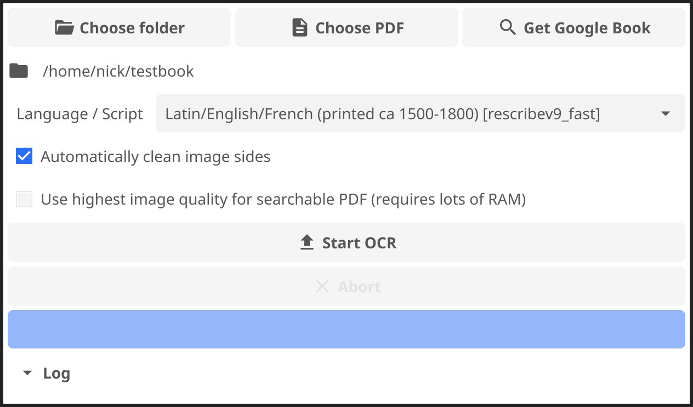

## Caveat

I haven't used `fyne-cross` before

Some of the things I discuss may be better solved with that.

Let me know!

# Rescribe

OCR software I developed a few years ago, and maintain.

[https://rescribe.xyz/rescribe](https://rescribe.xyz/rescribe) | [https://github.com/rescribe/bookpipeline](https://github.com/rescribe/bookpipeline)

Look in the `cmd/rescribe` directory

{width=50%}

# Creating a universal binary for Mac

See `cmd/rescribe/makefile`

First compile the amd64 & arm64 versions (`osxcross` / `fyne-cross`)

	CC="o64-clang" GOOS=darwin GOARCH=amd64 go build -o rescribe-amd64 .
	CC="oa64-clang" GOOS=darwin GOARCH=arm64 go build -o rescribe-arm64 .

Then use `lipo` to combine them:

	lipo -create rescribe-amd64 rescribe-arm64 -output rescribe

Then use `fyne package` to create the .app, and `codesign` to sign it.

	fyne package --release --certificate Rescribe --id xyz.rescribe.rescribe \
	  --name Rescribe --exe rescribe --os darwin --icon icon.png --appVersion 1.4.0
	codesign -s MyCert Rescribe.app

## Making codesign work

I don't know how to do this without a Mac, or on the command line.

- Open Keychain Access
- Keychain Access -> Certificate Assistant -> Create Certificate
- Enter a name (you pass this to `-s myname` in the `codesign` command)
- Set "Certificate Type" to "Code Signing"

# Embedding native binaries

Can cross-compile other binaries and pick the appropriate one using build constraints.

	embed_windows.go
	//go:embed tesseract-w32.zip
	var tesszip []byte

	embed_darwin_arm64.go
	//go:embed tesseract-osx-m1.zip
	var tesszip []byte

	embed_other.go
	//go:build (!darwin && !windows)
	var tesszip []byte

Can unpack whatever is in `tesszip` into a temporary directory and call the appropriate command, or skip this step if it's empty.

## Downloading the zip files

You can create a small go program to download the zip files to embed.

	getembeds.go:
	//go:build ignore
	package main
	// download needed files and check checksums...

	main.go:
	package main
	//go:generate go run getembeds.go
	// regular go program continues...

Then they can be downloaded by running `go generate`.

## Making these embedded binaries work

Dynamically compiled binaries are can be hard make portable.

Need to make them look in their directory for the libraries they load in.

Windows binaries already do this by default, so just find any .dlls and put them there.

Linux binaries can often be easily rebuild statically.

Mac is a pain...

## Making these embedded binaries work on Mac

First find all the .dylib files it needs:

	otool -L tesseract
	otool -L libname.dylib

Then set them to look in the same directory as the parent, for libraries linked to executable and other libraries.

	install_name_tool -change /usr/local/opt/libpng/lib/libpng16.16.dylib \
	  @executable_path/libpng16.16.dylib liblept.5.dylib

Then re-sign the executables and libraries:

	codesign -f -s - liblept.5.dylib

Is there an easier way to do this?

## Making these embedded binaries work

And of course, this has to be done on every architecture you want to support.

# Linux packaging with Flatpak

Need to create a YAML file describing how to build it.

Build environment doesn't have internet access, so need to vendor all modules, upload them, and add it to YAML sources.

	go mod vendor
	tar c vendor | xz > modules-yyyymmdd.tar.xz

## Useful build tags

Fyne provides several build tags which are useful for flatpaks.

The `flatpak` tag enables desktop portals, so that native file picker is used and the app is better sandboxed.

The `wayland` tag enables wayland rendering, which is better for modern Linux systems.

Not all systems support wayland, so we can build both versions and create a launcher script to pick one. Flatpaks run in a sandbox, so set any working directories or similar in the launcher script too.

Thanks to Jacob Alzén for his work making this all work so well with Fyne.

## YAML extract

	build-commands:
	  - cd cmd/rescribe && go build -tags flatpak .
	  - cd cmd/rescribe && go build -tags flatpak,wayland -o rescribe-wayland .
	  - install -Dm00755 cmd/rescribe/rescribe $FLATPAK_DEST/bin/rescribe-bin
	  - install -Dm00755 cmd/rescribe/rescribe-wayland $FLATPAK_DEST/bin/rescribe-bin-wayland
	  - printf '(launcher script)' > $FLATPACK_DEST/bin/rescribe

Launcher script:

	#!/bin/sh
	export TMPDIR=$XDG_RUNTIME_DIR
	bin=rescribe-bin
	test -n "$WAYLAND_DISPLAY" && bin=rescribe-bin-wayland
	"$bin"

# Graceful fallbacks

It is worth making sure that basic tools like `fyne get` and `go run` work well.

Ensure that anything complex to build and optional is behind build tags which you can set in a makefile.

Embedded binaries are optional in rescribe, if you don't include the `embed` tag they will not be included, and the code will detect that they aren't included and fall back to other behaviour.

## The end

nick@rescribe.xyz

[https://github.com/nickjwhite/fyneconf2024-talk](https://github.com/nickjwhite/fyneconf2024-talk)

[https://rescribe.xyz/rescribe](https://rescribe.xyz/rescribe)

[https://github.com/rescribe/bookpipeline](https://github.com/rescribe/bookpipeline)
